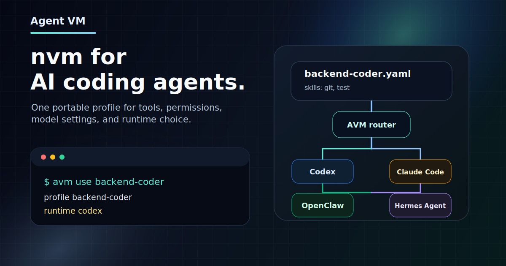

<p align="center">
  
</p>

<h1 align="center">Agent VM</h1>

<p align="center">
  <strong>nvm for AI coding agents.</strong>
  <br>
  Manage Agent profiles and working environments, then apply them to Codex, Claude Code, OpenCode, Cline, or Cursor.
</p>

<p align="center">
  <a href="https://github.com/xz1220/Agent-VM/actions/workflows/ci.yml"></a>
  
  
  
</p>

<p align="center">
  English | <a href="README.zh-CN.md">简体中文</a>
</p>

Agent VM, or `avm`, is a local manager for AI coding agent configuration. It gives
users a small set of durable objects:

- **Agent**: a reusable agent profile with instructions, skills, MCP servers,
  permissions, model preferences, and runtime preferences.
- **Environment**: a named working scenario that maps one or more runtimes to
  agents.
- **Package**: a distributable bundle that can install agents, environments, and
  their referenced capabilities.
- **Runtime**: the target tool where an agent becomes active, such as Codex,
  Claude Code, OpenCode, Cline, or Cursor.

Everything else is supporting machinery. Skills are part of an Agent profile.
Runtime detection and syncing are implementation details behind `avm use` and
the managed activation model.

## Daily Path

```bash
avm create
avm use backend-coder
codex
```

The intended path is simple:

1. Install and initialize AVM.
2. Create an Agent profile with the current preview wizard.
3. Optionally group agents into an Environment.
4. Use an Agent or Environment in the current shell.
5. Start your runtime.

```text
Package / existing Agent
  -> create Agent
    -> use Agent or Environment
      -> runtime-specific managed config
        -> Codex / Claude Code / OpenCode / Cline / Cursor
```

## User Modules

### 1. Install, Initialize, And Uninstall

This module owns AVM's lifecycle on the machine.

Current preview:

```bash
curl -fsSL https://raw.githubusercontent.com/xz1220/Agent-VM/main/scripts/install.sh | sh
avm init
avm shell init zsh
```

The installer puts `avm` in `$HOME/.local/bin` by default, installs shell
integration into your shell rc file, and initializes `~/.avm` unless
`AVM_SKIP_INIT=1` is set.

Product target:

```bash
avm init
avm doctor
avm uninstall
avm shell install
avm shell uninstall
```

### 2. Agent Configuration

Agent configuration is the primary product surface. An Agent owns its skills,
MCP servers, model preferences, permissions, instructions, and runtime
preferences.

Current preview:

```bash
avm create
avm create backend-coder
avm create --from default --name api-coder

avm agent create backend-coder --runtime codex --skills git,test
avm agent clone backend-coder --name backend-reviewer
avm agent edit backend-reviewer
avm agent rename backend-reviewer reviewer --update-refs
avm agent delete reviewer --force
avm agent list
avm agent show backend-coder
avm agent show backend-coder --runtime codex
```

Agent CRUD surface:

```bash
avm agent create
avm agent list
avm agent show <name>
avm agent edit <name>
avm agent delete <name>
avm agent clone <name> --name <new-name>
avm agent rename <old-name> <new-name>
```

`avm create` remains the first-run wizard and shortcut entry. It should create an
Agent from one of these sources:

- a blank/default Agent
- a built-in or installed Package
- an existing Agent

### 3. Environment Configuration

An Environment is a working scenario. It maps runtimes to Agent profiles and is
useful only when a user wants one named setup to cover multiple tools.

Current preview:

```bash
avm env create work \
  --codex backend-coder \
  --claude-code reviewer \
  --opencode opencode-coder
```

Product target:

```bash
avm env create
avm env list
avm env show <name>
avm env edit <name>
avm env delete <name>
avm env clone <name> --name <new-name>
avm env rename <old-name> <new-name>
```

Use an Agent when there is one active role. Use an Environment when a scenario
needs different agents for different runtimes.

### 4. Use And Activation

This is the daily switching surface.

```bash
avm use backend-coder
avm use --kind env work
avm status
avm deactivate
```

With shell integration installed, `avm use` updates the current shell so runtime
environment variables such as `CODEX_HOME`, `CLAUDE_CONFIG_DIR`, and
`OPENCODE_CONFIG_DIR` point to AVM-managed runtime homes.

`avm sync` exists in the preview, but it should be treated as an advanced repair
or debugging command rather than a primary user module.

### 5. Packages

Packages are for distribution and reuse. Users install packages to get Agents,
Environments, and referenced capabilities; they do not usually "use" a package
directly.

Current preview:

```bash
avm package list
avm package show reviewer
avm package inspect backend-coder.avm.zip
avm export backend-coder --output backend-coder.avm.zip
avm install backend-coder.avm.zip
```

Product target:

```bash
avm package list
avm package show <package>
avm package install <package-or-file>
avm package uninstall <package>
avm package export <agent-or-env>
avm package inspect <file.avm.zip>
```

### 6. Memory

Memory is intentionally not part of the main path yet. The preview has
`avm memory import --dry-run`, but the product model should not force users to
understand memory before Agent and Environment CRUD is complete.

## Runtime Support

AVM renders Agent or Environment activation into runtime-specific managed files.

| Runtime | Status | Notes |
| --- | --- | --- |
| Codex | Supported | Native profile/model/reasoning mapping where available |
| Claude Code | Supported | Agent frontmatter and MCP/skills mapping |
| OpenCode | Supported | Config, agent, skills, and MCP mapping |
| Cline | Compatibility | Mostly rendered as rules/MCP settings |
| Cursor | Compatibility | Conservative rules/MCP proof of concept |

Adapters must report each field as `native`, `rendered_as_instructions`,
`ignored`, or `unsupported`. AVM should not pretend every runtime supports the
same feature set.

## Current Preview Gaps

The current CLI already proves the local activation model, but the product
surface is not finished.

| Area | Available today | Gap |
| --- | --- | --- |
| Agent | `create`, `list`, `show` | missing edit/delete/rename/clone and safe create-only semantics |
| Environment | `create` | missing list/show/edit/delete/rename/clone |
| Install lifecycle | installer, `init`, `shell init` | missing first-class doctor/uninstall commands |
| Package | list/show/inspect/export/install | install/export naming still split across commands |
| Skills | `skill list` | should be surfaced primarily inside Agent create/edit |
| Sync | `sync` | should mostly disappear behind `use`/activation |
| Memory | import dry-run | intentionally deferred from the main path |

## Safety Model

AVM is conservative by default:

- installer initialization and `avm init` write under `~/.avm`.
- Agent and Environment config should become explicit CRUD resources, not
  implicit overwrites.
- Runtime-native files are written only through adapter-declared managed paths.
- Unsupported runtime fields are reported, not silently dropped.
- Secrets should be referenced through environment variables, not exported as
  plaintext profile data.

## Development

```bash
make test
make vet
make fmt
make build
```

The main package is `cmd/avm`. Core packages live under `internal/config`,
`internal/adapter`, `internal/memory`, `internal/sync`, and `internal/state`.

Useful project docs:

- [Product requirements](docs/product/prd.md)
- [Technical design](docs/design/tech-design.md)
- [Architecture](docs/engineering/architecture.md)
- [Data model](docs/engineering/data-model.md)
- [Implementation plan](docs/engineering/implementation-plan.md)
- [Acceptance criteria](docs/engineering/acceptance.md)

## License

No open-source license has been selected yet. Until a license is added, the code
is source-available but not broadly reusable under an open-source license.
