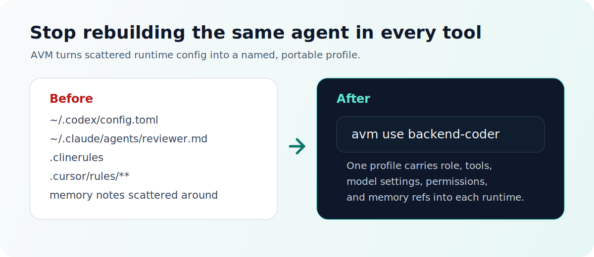

<p align="center">
  
</p>

<h1 align="center">Agent VM</h1>

<p align="center">
  <strong>nvm for AI coding agents.</strong>
  <br>
  One portable profile for tools, permissions, model settings, and memory refs.
</p>

<p align="center">
  <a href="https://github.com/xz1220/Agent-VM/actions/workflows/ci.yml"></a>
  
  
  
</p>

Agent VM, or `avm`, is a local control plane for AI coding agent profiles. It
lets you define an agent once, then render that profile into runtimes such as
Codex, Claude Code, Cline, and Cursor.

The bet: developers will not standardize on one coding agent. The missing layer
is a portable object that says who an agent is, what it can use, which model
settings it prefers, what permissions it has, and which long-lived memory it
should carry.

<p align="center">
  
</p>

## The Move

```bash
avm use backend-coder
```

That command should become the muscle memory for switching your local AI coding
setup. Instead of rebuilding the same role across prompt files, MCP config,
rules directories, and memory notes, AVM makes the agent profile the source of
truth.

```text
backend-coder.yaml
  -> avm use backend-coder
    -> Codex profile
    -> Claude Code agent
    -> Cline rules
    -> Cursor rules
```

## Why This Is Different

| Approach | What it manages | What it misses |
| --- | --- | --- |
| Dotfiles | Files and symlinks | No agent object, no mapping status |
| MCP config managers | Tool server config | Usually no role, memory, model, or permission model |
| Runtime-native profiles | One ecosystem | Hard to carry across tools |
| Agent VM | Agent Profile + capabilities + memory refs + adapters | Early, still building concrete adapters |

AVM is not trying to flatten every runtime into the same interface. Each adapter
must report how fields map: `native`, `rendered_as_instructions`, `ignored`, or
`unsupported`.

## What A Profile Carries

| Layer | Example |
| --- | --- |
| Identity | `backend-coder`, `pr-reviewer`, `incident-runner` |
| Runtime | `codex`, `claude-code`, `cline`, `cursor` |
| Model run | model name, reasoning effort, verbosity |
| Capabilities | skills, commands, hooks, MCP servers, toolsets |
| Permissions | approval mode, sandbox intent, allow/deny policy |
| Memory refs | project architecture, team conventions, user preferences |

## Recipes

<details open>
<summary><strong>backend-coder</strong></summary>

```yaml
name: backend-coder
runtime:
  preferred: codex
model_run:
  model: gpt-5.4
  reasoning_effort: high
capabilities:
  skills: [git, test, migration]
  mcps: [github, postgres-readonly]
permissions:
  approval: on-risky-actions
  sandbox: workspace-write
memory_refs:
  - id: backend-standards
    scope: project
    mode: read
```

</details>

<details>
<summary><strong>pr-reviewer</strong></summary>

```yaml
name: pr-reviewer
runtime:
  preferred: claude-code
capabilities:
  skills: [review, security, test-analysis]
  mcps: [github]
permissions:
  approval: never
  sandbox: read-only
memory_refs:
  - id: review-policy
    scope: team
    mode: read
```

</details>

<details>
<summary><strong>incident-runner</strong></summary>

```yaml
name: incident-runner
runtime:
  preferred: codex
capabilities:
  skills: [diagnose, summarize, runbook]
  mcps: [logs-readonly, github]
permissions:
  approval: prompt
  sandbox: read-only
memory_refs:
  - id: incident-runbooks
    scope: team
    mode: read
```

</details>

## Status

This repository is an early preview. The core model and first CLI slices are in
place; profile activation is the next major milestone.

Working today:

- `avm init`
- `avm agent create/list/show`
- `avm env create`
- `avm memory import --from <file> --dry-run`
- config validation and resolution tests
- adapter contract, fake adapter, and Phase 1 fixtures

In progress:

- `avm use <profile-or-env>`
- `avm status`
- `avm deactivate`
- concrete Codex and Claude Code adapter writes
- release packaging

## Quickstart

Prerequisites:

- Go 1.22+

Run from source:

```bash
git clone https://github.com/xz1220/Agent-VM.git
cd Agent-VM

go run ./cmd/avm --help
go run ./cmd/avm init
```

Create a profile:

```bash
go run ./cmd/avm agent create backend-coder \
  --runtime codex \
  --model gpt-5.4 \
  --reasoning high \
  --skills git,test \
  --mcps github \
  --memory backend-standards:project
```

Inspect it:

```bash
go run ./cmd/avm agent list
go run ./cmd/avm agent show backend-coder
```

Preview a portable memory import:

```bash
go run ./cmd/avm memory import \
  --from testdata/memory/backend-standards.md \
  --dry-run
```

Build locally:

```bash
make build
./bin/avm --help
```

## Target CLI Experience

This is the intended Phase 1 loop once activation lands:

```bash
avm init
avm agent create backend-coder --runtime codex --skills git,test
avm use backend-coder
avm status
```

Expected status shape:

```text
active   profile:backend-coder
runtime  codex          native: model, permissions
runtime  claude-code    rendered: skills, memory_refs
runtime  cline          unsupported: lifecycle_hooks
```

## Safety Model

AVM is designed to be conservative by default:

- `avm init` only writes under `~/.avm`.
- Runtime-native memory is imported only through explicit commands.
- Memory import supports dry-run reporting before writes.
- Adapters own explicit managed paths.
- Runtime fields that cannot be represented must be reported, not dropped.
- Secrets should be referenced through environment variables, not exported as
  plaintext profile data.

## Roadmap

| Phase | Theme | Headline |
| --- | --- | --- |
| 1 | Local profile activation | `avm use <profile>` |
| 2 | Runtime coverage | Codex, Claude Code, Cline, Cursor adapters |
| 3 | Portable memory | explicit import/export/diff/push/pull |
| 4 | Team registry | shareable agent profiles with policy and audit |

See [ROADMAP.md](ROADMAP.md).

## Project Docs

- [Product requirements](docs/product/prd.md)
- [Technical design](docs/design/tech-design.md)
- [Architecture](docs/engineering/architecture.md)
- [Data model](docs/engineering/data-model.md)
- [Implementation plan](docs/engineering/implementation-plan.md)
- [Acceptance criteria](docs/engineering/acceptance.md)
- [GitHub launch checklist](docs/marketing/github-launch-checklist.md)

## Development

```bash
make test
make vet
make fmt
make build
```

The main package is `cmd/avm`. Core packages live under `internal/config`,
`internal/adapter`, `internal/memory`, `internal/sync`, and `internal/state`.

## Contributing

AVM is early. The most useful contributions right now are narrow and concrete:

- runtime mapping research for Codex, Claude Code, Cline, Cursor, and GitHub
  Copilot custom agents
- adapter fixtures
- CLI behavior tests
- docs that explain real workflows
- bug reports from people managing multiple AI coding tools

See [CONTRIBUTING.md](CONTRIBUTING.md).

## License

No open-source license has been selected yet. Until a license is added, the code
is source-available but not broadly reusable under an open-source license.
