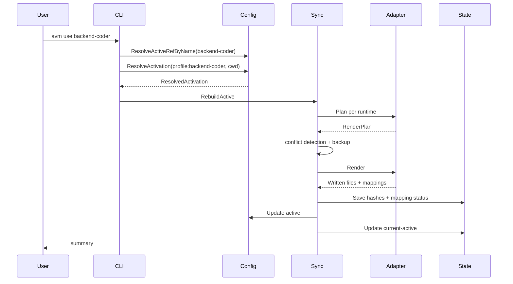

# Agent VM — 核心流程设计

> 最后更新：2026-04-24（v5 — Agent Profile 优先工作流）

本文档描述 Phase 1 CLI 的输入、输出和执行流程。

---

## 1. `avm init`

**功能：** 初始化 AVM，扫描已安装 runtime，导入可识别配置，创建默认 Agent Profile 和 default env。

**不变量：** `avm init` 是只读导入流程。它只能写入 `~/.avm/**`，不得修改 Claude Code、Codex、Cline、Cursor 等 runtime 的原始配置文件；runtime 文件只有在后续执行 `avm use/sync` 时才会进入受控写入。

**输入：**

```bash
avm init [--force] [--template <name|url>]
```

**输出：**

- 创建 `~/.avm/` 目录结构。
- 创建 `config.yaml`。
- 创建 `agents/default.yaml`。
- 创建 `envs/default.yaml`。
- 初始化 `state/sync-state.json`。
- 不写入或覆盖 runtime 配置文件。

**流程：**

```go
func Init(opts InitOptions) error {
    ensureAvmDir(opts.Force)
    createBaseDirs()

    createDefaultAgent()
    createDefaultEnv()

    writeGlobalConfig()
    writeEmptySyncState()
    return nil
}
```

## 2. `avm agent create`

**功能：** 创建 Agent Profile。

**输入：**

```bash
avm agent create backend-coder \
  --runtime codex \
  --skills test,migration \
  --mcps github,postgres-readonly \
  --memory project-architecture

avm agent create reviewer --runtime claude-code --model gpt-5.4 --reasoning high --skills review --mcps github
```

**输出：**

- 写入 `~/.avm/agents/<name>.yaml`。
- 可选通过 `--local` 写入 `<project>/.avm/agents/<name>.yaml`。
- 不立即写 runtime 文件，除非用户继续执行 `avm use/sync`。

**流程：**

```go
func AgentCreate(name string, opts AgentCreateOptions) error {
    validateName(name)
    ensureRuntimeKnown(opts.Runtime)
    ensureNotExists(name, opts.Scope)

    agent := NewAgentFromRuntimeTemplate(name, opts.Runtime)
    applyCLIOverrides(&agent, opts)
    validateAgent(agent)
    writeAgent(agent, opts.Scope)
    return nil
}
```

---

## 3. `avm agent list/show`

**功能：** 查看 Agent Profile。

```bash
avm agent list
avm agent show backend-coder
avm agent show backend-coder --runtime codex
```

`show --runtime` 需要展示 adapter mapping preview：

```text
Agent: backend-coder
Runtime: codex

Native:
  model_run.model -> agents.backend-coder.toml model
  permissions.sandbox -> agents.backend-coder.toml sandbox_mode

Rendered as instructions:
  capabilities.skills
  memory_refs
```

---

## 4. `avm env create`

**功能：** 创建多 runtime 工作场景映射。Environment 不声明 capabilities 或 memory，它只说明每个 runtime 默认使用哪个 Agent Profile。

**输入：**

```bash
avm env create backend-dev \
  --codex backend-coder \
  --claude-code code-reviewer \
  --cline backend-assistant
```

项目级：

```bash
avm env create backend-dev --local --codex project-backend-coder
```

**流程：**

```go
func EnvCreate(name string, opts EnvCreateOptions) error {
    validateName(name)
    validateRuntimeAgentRefs(opts.RuntimeAgents, opts.Scope)
    validateTargets(opts.Targets)

    if opts.Local {
        active := readGlobalConfig().Active
        if active.Kind != "env" {
            return fmt.Errorf("--local env override requires active env")
        }
        override := ProjectOverride{Extends: active.Name, RuntimeAgents: opts.RuntimeAgents, ...}
        return writeProjectOverride(cwd, override)
    }

    env := Environment{Name: name, RuntimeAgents: opts.RuntimeAgents, ...}
    return writeEnvironment(env)
}
```

---

## 5. `avm use`

**功能：** 激活 Agent Profile 或多 runtime Environment，并同步到 runtime。

**输入：**

```bash
avm use backend-coder
avm use backend-dev
```

**输出：**

- 重建 `~/.avm/active/`。
- 写入 runtime managed paths。
- 更新 `config.yaml.active`。
- 更新 `state/current-active`，供 shell prompt 展示。
- 更新 `sync-state.json`。

**流程：**

```go
func Use(name string) error {
    ref, err := config.ResolveActiveRefByName(name, cwd) // profile 优先；同名冲突时要求 --kind
    if err != nil {
        return err
    }
    return syncer.SyncActivation(ref, cwd, sync.Options{
        UpdateActive: true,
    })
}
```

**时序：**



---

## 6. `avm shell init`

**功能：** 输出 shell 初始化脚本，让命令行 prompt 显示当前 AVM active profile/env。

```bash
eval "$(avm shell init zsh)"
eval "$(avm shell init bash)"
```

启用后：

```text
(avm:backend-coder) ~/repo $ codex
(avm:backend-dev) ~/repo $ claude
```

**边界：**

- prompt 展示读取 `~/.avm/state/current-active`，避免每次渲染 prompt 都解析 YAML。
- `avm shell init` 不写 runtime 配置。
- 多个 Agent CLI 使用当前 profile/env，依赖的是此前 `avm use` 已经写入 runtime managed paths。
- Phase 1 不做 shell-local activation；active profile/env 是持久状态。

伪代码：

```go
func ShellInit(shell string) error {
    switch shell {
    case "zsh":
        printZshPromptHook()
    case "bash":
        printBashPromptHook()
    case "fish":
        printFishPromptHook()
    default:
        return fmt.Errorf("unsupported shell: %s", shell)
    }
    return nil
}
```

---

## 7. `avm deactivate`

**功能：** 退出当前 Agent 工作环境，回到 `default` Agent Profile。

```bash
avm deactivate
```

等价于：

```bash
avm use default
```

执行后 shell prompt 从：

```text
(avm:backend-coder) ~/repo $
```

变为：

```text
(avm:default) ~/repo $
```

---

## 8. Runtime 写入示例

### Claude Code

`avm use backend-coder` 或 `avm use backend-dev` 可能写入：

```text
<project>/.claude/agents/backend-coder.md
<project>/.mcp.json
~/.claude/skills -> ~/.avm/active/skills
```

### Codex

```text
~/.codex/config.toml
~/.codex/agents/backend-coder.toml
```

### Cline

```text
~/.cline/data/settings/cline_mcp_settings.json
<project>/.clinerules/avm/backend-coder.md
```

---

## 9. `avm sync`

**功能：** 重新同步当前 active profile/env，不改变 active 名称。

```bash
avm sync
avm sync --target codex
```

普通同步：

```go
func Sync(opts SyncOptions) error {
    cfg := config.ReadGlobalConfig()
    return syncer.SyncActivation(cfg.Active, cwd, sync.Options{
        UpdateActive: false,
        Targets: opts.Targets,
    })
}
```

sync 成功后刷新 `state/current-active`，保持 shell prompt 和 `config.yaml.active` 一致。Phase 1 不提供 watch 模式。

---

## 10. `avm memory import --dry-run`

**功能：** 从 runtime native memory、rules 或 markdown/yaml 中生成 portable memory 候选 diff，但不写入 `~/.avm/memory/` 或 runtime 文件。

```bash
avm memory import --from claude-code --dry-run
avm memory import --from ./CLAUDE.md --dry-run
```

输出示例：

```text
Memory import dry-run: claude-code

New candidates:
  project-architecture  project  ~/.avm/memory/project/project-architecture.md

Conflicts:
  none

No files written. Run without --dry-run to import selected entries.
```

流程：

```go
func MemoryImport(opts MemoryImportOptions) error {
    plan, err := memory.ImportDryRun(opts)
    if err != nil {
        return err
    }
    printMemoryDiff(plan)
    if opts.DryRun {
        return nil
    }
    return memory.ApplyImportWithConfirmation(plan)
}
```

边界：

- `--dry-run` 必须只读。
- 默认不写回 runtime native memory。
- Phase 2 的 `memory push/pull` 必须在写回前展示 diff 并要求用户确认。

---

## 11. `avm status`

**功能：** 展示 active profile/env、targets、sync 状态、冲突和 unsupported mappings。

示例：

```text
Active profile: backend-coder

Agents:
  backend-coder       global   implementation

Targets:
  codex         synced   backend-coder, 2 MCPs, 4 rendered fields

Mappings:
  codex: capabilities.skills rendered as instructions

Shell prompt: enabled (avm:backend-coder)
```

---

## 12. `avm export/import`

### Export

```bash
avm export coding --output coding.avm.zip
avm export backend-coder --output backend-coder.avm.zip
```

输出包含：

- active profile YAML, or env YAML plus referenced profile YAML
- referenced capabilities
- referenced memory metadata/files
- export manifest

默认不包含 runtime 输出文件和 backups。

### Import

```bash
avm import coding.avm.zip
```

流程：

1. 读取 manifest。
2. 校验版本。
3. 检查同名冲突。
4. 写入 agents/envs/registry/memory。
5. 不自动 `use`，只提示下一步。

---

## 13. 冲突处理

冲突提示：

```text
Conflict detected in codex:
  ~/.codex/config.toml was modified outside AVM

Choose:
  1. Keep AVM version
  2. Keep local version and skip codex
  3. Show diff
```

策略：

- `prompt`: 交互选择。
- `avm-wins`: 备份后覆盖。
- `local-wins`: 跳过该 runtime。

---

## 14. 错误处理

| 场景 | 行为 |
|------|------|
| profile/env 不存在 | 退出码 1 |
| agent 引用不存在 | 退出码 1 |
| target 未安装 | warning，跳过 |
| adapter render 失败 | 当前 runtime failed，其他 runtime 继续 |
| unsupported mapping | 不失败，status 展示 |
| backup 失败 | 当前 runtime failed，不写入 |
